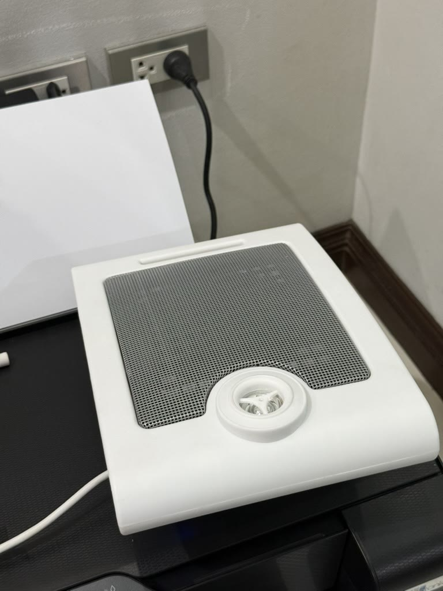

# pa-bridge-ip-615wdc

> `vendor/` (BUENA's `libCtsSdk` and headers) is **gitignored and must never be committed** —
> it is the vendor's proprietary code, not ours to redistribute. Site addresses, MACs, serials
> and host names are deliberately absent from this repo and its history.

Bridge an Asterisk PBX to BUENA / SPA-Audio **IP- series** network PA speakers, on Linux,
without the vendor's Windows server.

Named after the speaker that started it: a **BUENA IP-615WDC** bought to join a house
all-call page, which turned out to speak none of the protocols the plan assumed.



*The unit this was written against. One pigtail, carrying an RJ45 and a DC barrel jack — PoE or
DC 12–24 V, either one.*

## Why this exists

The IP- series terminal registers to a **Server IP**, and the vendor's `TbsServer.exe`
(Windows only) does the paging — so keeping a Windows box on 24/7 to run a PA system is the
shape the product assumes, and nobody wants that.

> **Note, 2026-08-20:** these speakers *do* also support plain SIP registration
> (*Settings → Main Device Settings → SIP Settings* in `Config Tool V5.7.5`), which this repo
> initially got wrong. For a single speaker on a PBX, native SIP is simpler than this bridge.
> The bridge still earns its place for paging several terminals from one call and for
> scheduled playback (`TSDK_BroadMp3File` + cron) with no Windows involved.

But BUENA publishes a **C SDK for Linux** for this exact product line, and the numbers line up
perfectly:

| | |
|---|---|
| Asterisk's `AudioSocket()` application sends | 8 kHz, 16-bit, mono PCM |
| `TSDK_BroadPcmVoice()` wants | 8 kHz, 16-bit, mono PCM, length a **multiple of 320** |

Same sample rate, same width, same endianness — no resampling and no transcoding, only
re-framing (Asterisk's frame size follows the channel: 160 bytes from a call, 320 from file
playback). The bridge is plumbing:

```
phone ──▶ Asterisk ──AudioSocket(uuid,<bridge>:9092)──▶  pa-bridge  ──libCtsSdk──▶  speaker
                     (the application, not the channel driver)      (this repo)
```

```
exten => <ext>,1,Answer()
exten => <ext>,n,AudioSocket(<uuid>,127.0.0.1:9092)
exten => <ext>,n,Hangup()
```

`TSDK_Init(cb, /*bServerMode=*/TRUE, …)` means **pa-bridge is the server the speakers register
to** — it replaces `TbsServer.exe` outright. Scheduled announcements become cron plus
`TSDK_BroadMp3File()`.

## Quick start

There is no binary here on purpose: the bridge links BUENA's `libCtsSdk.a` statically, so a
prebuilt one would redistribute their proprietary library. Building it is four steps and a few
minutes.

```bash
# 1-2. fetch the vendor SDK from their public download page, verify it, unpack
#      the x86-64 build into vendor/sdk/  (SDK_ZIP=/path/to/zip to use a local copy)
#      https://www.buenapa.com/?download/  ->  "IP-Series System SDK Package"
./scripts/fetch-sdk.sh

# 3. build — match the container tag to the Debian release of the machine that will RUN it
docker build -t pa-bridge-build .
docker run --rm -v "$PWD:/src" -w /src/src pa-bridge-build make

# 4. install (three files, one firewall rule)
scp src/pa-bridge deploy/pa-volume  <host>:/usr/local/bin/
scp deploy/pa-bridge.service        <host>:/etc/systemd/system/
ssh <host> 'chmod 755 /usr/local/bin/pa-volume && systemctl daemon-reload && systemctl enable --now pa-bridge'
ssh <host> 'ufw allow from <your-lan>/22 to any port 29783 proto tcp'
```

Then point each speaker's **Center Server** at that host with the vendor's Windows config tool,
and reboot the speaker. It appears in the log by itself — no per-device configuration here.

`make` refuses to run with a plain explanation if the SDK is missing, and
[`docs/build-and-deploy.md`](docs/build-and-deploy.md) covers the three ways the build bites
(the ARM tree named `X64`, `-no-pie`, and the headers that need `WINAPI` defined first).

Without Docker: any Debian 12 box with `build-essential` will do — `cd src && make`.

## Status — in production

Dial the speaker's extension and talk; the audio comes out of it. It also joins the PBX's
all-call page group. Running as a systemd service on the PBX itself.

| | |
|---|---|
| Builds on Debian 12 x86-64 | ✅ clean, no warnings |
| Speaker registers to the bridge | ✅ terminal learned from the SDK's own connect event |
| **Live audio from a phone call** | ✅ **intelligible speech, confirmed by ear** |
| PBX page group | ✅ reached through a `Local/…` channel |
| Volume control | ✅ `pa-volume [0-100]`, re-applied on every reconnect |
| Deployment | ✅ systemd unit, `Restart=always`, enabled at boot |
| Multiple speakers | ⏳ untested — the code keeps a registry and pages a group, so it should work |
| Return audio (talkback) | ✗ not implemented; this model has no microphone |

Five things had to be understood before any of it worked, all of them now handled in the code
and none of them documented by the vendor:

**The terminal ID is not the number the config tool shows.** `dwTermID` is `zone << 16 | device`,
so the tool's zone 1 / device 1 is `0x00010001` = 65537. Passing `1` returns
`-802 CERR_INVALID_PARAMETER` forever, which then makes `StartBroadVoice` fail with `-916`. The
bridge reads the ID out of `CB_Event_TermConnect` instead of trusting anything typed by hand.

**The firmware dials TCP 29783; the SDK listens on 29883.** There is no API to move the SDK's
port and the number is a compiled-in constant, so the bridge accepts 29783 itself and pumps the
bytes through to the SDK over loopback. No iptables rule, no helper process.

**Asterisk's frame size follows the channel, not the clock.** A softphone call arrives as
160-byte (10 ms) frames while file playback gives 320. `TSDK_BroadPcmVoice()` only accepts
multiples of 320, so the bridge re-frames internally. Dropping odd-sized frames — the obvious
first implementation — makes test tones work perfectly and real calls silent.

**Use the `AudioSocket()` application, not `Dial(AudioSocket/...)`.** The channel driver hands
the socket whatever codec the caller negotiated: a ulaw softphone sends 8-bit companded bytes,
the SDK reads them as 16-bit PCM, and the speaker plays hiss. The application always sends
16-bit 8 kHz PCM. This one is visible in Asterisk's own docs, in a parenthesis.

**Set volume with the coarse 0–10 level, never the 0–100 "Ex" call.**
`TSDK_Req_SetAudLevelEx()` returns success and then does the wrong thing on this firmware:
100 became level 10 and was deafening, while 60, 40 and 30 all collapsed to level 1 and were
inaudible. `TSDK_Req_SetAudLevel()` sets the level directly and behaves.

## Layout

```
src/pa-bridge.c        the bridge (~450 lines)
src/Makefile           builds against vendor/sdk
deploy/pa-bridge.service   systemd unit
docs/build-and-deploy.md   build on the build host, run on the PBX host, and why they differ
docs/operations.md         running it: volume, control port, verification, troubleshooting
docs/protocol.md           what the wire looks like: ports, terminal IDs, measured behaviours
docs/sdk-notes.md          the SDK API, decoded from its GBK headers
docs/device.md             the speaker, and how it was misidentified
vendor/                 (gitignored) BUENA's SDK — not ours to redistribute
```

## Getting the SDK

Not in this repo. Extract `SDK__Linux__X64__V308__New` from BUENA's *IP-Series System SDK
Package* into `vendor/sdk/`, so that `vendor/sdk/Include/{cts_sdk.h,libCtsSdk.a}` exist.

It is published on the vendor's own download page as *IP-Series System SDK Package*.

⚠️ Take the **X64 V308** build. The newer V5086 tree is ARM despite `X64` appearing in one of
its directory names — linking it on x86-64 fails with *"relocations in generic ELF (EM: 40)"*.

## Links

| | |
|---|---|
| Vendor | BUENA / SPA-Audio — <https://www.buenapa.com/> |
| All downloads | <https://www.buenapa.com/?download/> and <https://www.buenapa.com/?download_2/> |
| SDK used here | <https://www.buenapa.com/static/upload/other/20250818/1755512660485720.zip> (11 MB) |
| Windows config tool | *SIP-Series / IP-Series Software and User Manual for windows* on the same page — needed once, to point a speaker's Center Server at the bridge |
| A product listing | <https://th.aliexpress.com/item/1005012080250093.html> |

Everything the vendor publishes is on those two download pages, ungated: SDKs, the Windows
tools, the manuals and a firmware package. ⚠️ Take the **IP-** series items — the `SIP-` ones are
a different, incompatible product line ([`docs/device.md`](docs/device.md)).

## Where the SDK comes from

The bridge links **BUENA / SPA-Audio's `libCtsSdk`**, which is their property. It is not in this
repository and is not redistributed by it — `scripts/fetch-sdk.sh` pulls it from their own
public download page at build time and verifies it before use.

| | |
|---|---|
| Download page | <https://www.buenapa.com/?download/> — the package is listed as **IP-Series System SDK Package** (a second page of downloads sits at `?download_2/`) |
| Direct file | <https://www.buenapa.com/static/upload/other/20250818/1755512660485720.zip> |
| Size / SHA-256 | 11,064,688 bytes · `b8598ca1e4304d30b0764bde1f34b3118f14f5939a99692a6e63abae20adf5a3` |
| Build used | `SDK Linux/SDK__Linux__X64__V308__New.tar.xz` → `Include/{cts_sdk.h, win_types.h, libCtsSdk.a, libCtsSdk.so}` |
| Retrieved | 2026-08-19; still served unchanged at the same size on 2026-08-21 |
| Terms | The package ships **no licence, EULA or readme** of any kind. Nothing grants redistribution, so this project does not redistribute it — anyone building here downloads it from the vendor themselves, exactly as we did |

The vendor's own `SDK/note.txt` states the package applies only to product models whose name
begins with `IP-`. What `docs/sdk-notes.md` records about that API — signatures, enum values,
frame sizes, and the two firmware bugs found — is interoperability information observed while
making hardware we own work; it is not a copy of their code.

If the checksum ever stops matching, the vendor has replaced the package. Compare it by hand
before trusting it, then update the value in the script.

## Tested with

Everything below was verified on real hardware; anything outside it is unknown rather than
unsupported.

| | |
|---|---|
| Speaker | BUENA **IP-615WDC**, device type `TM35`, BIOS **5.7.9** |
| SDK | `SDK__Linux__X64__V308__New` (x86-64). The ARM **V5086** tree exists but is untested here |
| PBX | **Asterisk 20.19.0** with `app_audiosocket` / `res_audiosocket` loaded |
| Runtime | Debian **12.13** (LXC container), built in a Debian 12 container |
| Scale | **one** speaker. The code keeps a terminal registry and pages a group, so more should work — but it has not been tried |
| Not implemented | return audio / talkback (this model has no microphone), and more than one concurrent call — pages are served one at a time on purpose |

## References

- Asterisk's **AudioSocket** protocol and channel driver —
  <https://docs.asterisk.org/Configuration/Channel-Drivers/AudioSocket/>
  (frame format: 1-byte type, 2-byte big-endian length, payload)
- The **`AudioSocket()` dialplan application**, which is what this bridge needs —
  <https://docs.asterisk.org/Asterisk_20_Documentation/API_Documentation/Dialplan_Applications/AudioSocket/>
  — note it always sends 16-bit 8 kHz PCM, unlike `Dial(AudioSocket/...)`
- **`Page()`**, for adding a speaker to an all-call group —
  <https://docs.asterisk.org/Asterisk_20_Documentation/API_Documentation/Dialplan_Applications/Page/>
- The vendor's two product pages for the same cabinet, which is where the confusion starts:
  **IP-615WDC** <https://www.buenapa.com/?list_14/293.html> ·
  **SIP-615WDC** <https://www.buenapa.com/?list_144/360.html>

If your speaker is the **SIP-** variant, you do not need this project at all: those register to
a PBX directly. If it supports plain multicast, Asterisk's `MulticastRTP` channel driver may
also reach it without any bridge — neither applies to the IP- series terminal here.

## Scope

This bridge, and the observations in `docs/`, are the useful part. Questions about the speakers
themselves — firmware, the Windows tools, why a setting does not stick, warranty — belong with
BUENA, who make them and answer on the contact details on their site. Nothing here is affiliated
with or endorsed by them.

Issues and patches about the bridge are welcome, especially from anyone running more than one
terminal or a different model in the IP- family, since both are untested here.

## Security model

Small, but worth being explicit about before you expose anything.

| Port | Bind | Auth | Notes |
|---|---|---|---|
| `29783/tcp` | all interfaces | **none** — the vendor protocol has no authentication | Must be reachable by the speakers. Restrict it to the VLAN they live on; anyone who can reach it can register a terminal or talk to the SDK |
| `9092/tcp` | all interfaces | none | Anyone who can reach it can **play audio through your speakers**. Keep it on loopback (run the bridge on the PBX) or firewall it to the PBX only |
| `9093/tcp` | `127.0.0.1` only | none | Volume control. Loopback by construction — a shell on the box is already enough to do worse |

The bridge parses two untrusted inputs: AudioSocket frames on 9092 and relayed bytes on 29783.
The frame parser bounds every length against its buffers and drops oversized frames rather than
truncating or copying them; the relay never interprets what it forwards. It runs happily as an
unprivileged user — the shipped unit uses `DynamicUser=yes`, `ProtectSystem=strict` and
`NoNewPrivileges=yes`, and needs no capabilities because none of its ports are privileged.

There is no authentication anywhere in the vendor's protocol, so **network placement is the
security boundary**. Treat these speakers like any other appliance that trusts its LAN.

## Related

The site-side record of this device — its addresses, the full diagnosis, the vendor download
set and the other five routes to Asterisk that were weighed — lives in the private house repo
under `docs/hardware/buena-speaker/`. Deliberately not duplicated here: this repo is the
software, that one is the installation.
